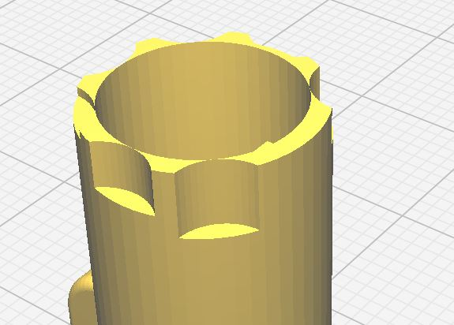
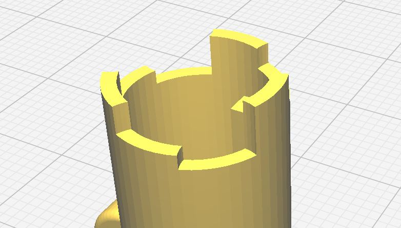
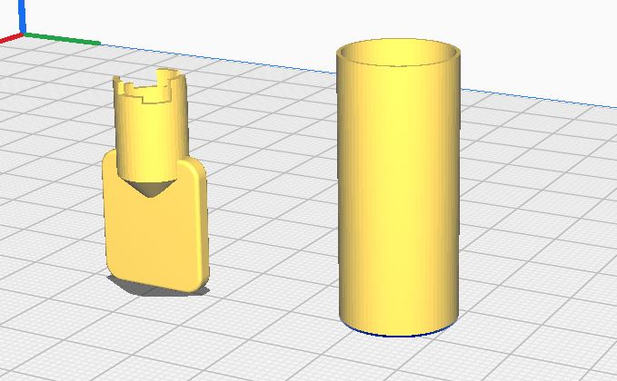
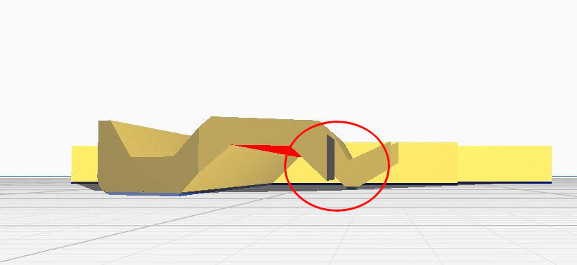

# 3DLocksmith
3D Printable keys, blanks, lock-picks and other printable stuff.

### Available blanks

- [GAM (Gerda)](./blanks/GAM/)
- [Kwikset KW1](./blanks/Kwikset%20KW1/)

### Available service keys

- [CH751](./service_keys/CH751/)
- [Kone 1V14001 (elevator "VIP" key)](./service_keys/Kone%201V14001/)
- [Kone 58989 (elevator computer box)](./service_keys/Kone%2058989/)
- [TSA "Travel sentry" master keys](./service_keys/TSA%20Master%20keys/)

### 3D printing keys - tutorial

Most keys have complicated shapes and precise bitting. They are designed to be cut or stamped on metal.

Precise printing is a domain of resin printers (SLA) - you've probably seen tiny and detailed figurines created on those.

While SLA printers are cheaper than most FDM (filament) printers, they are much harder to use - resin vapours are toxic and require proper ventilattion and protection equipment (mask, gloves, etc). In the long run - resin is also more expensive than regular filament and more brittle (unless you buy high-strength resin).

Don't worry though - FDM printers are precise enough for many keys to work fine. For other keys - we can use multiple hacks to make printer more precise or redesign the keys so they are easier to print but still open a lock.

#### Key strength

If you need to 3D print your key, you probably will use it occasionally. PLA printed keys work fine even on smaller locks, like padlocks. Rule of thumb is to use printed keys only on locks that are in good condition - you can insert key and move it without using much strength. Otherwise part of the key can break and stuck in the lock.

For this reason most of our tubular locks are redesigned to not contain small elements that can break.

In rare occasions - use printed key only to lift the pins but open the lock using your regular lock-picking tensioner.

#### Nozzle size

Default 0.4 mm nozzle works fine in most occasions. If your key needs smaller details printed correctly or uses unusually precise bitting - consider switching to 0.2 mm nozzle.

If you have 0.4 mm nozzle - you can specify in your slicer that you have 0.3 mm nozzle. Sometimes it can improve quality a bit but don't expect miracles.

#### Slicer settings

Proper slicer settings are the difference between working and not-working key. All settings we describe here are for Cura, other slicers probably have same settings named differently.

Below are recommended values tested by us.

| Setting        | Recommended value  | Comment                           |  
|----------------|--------------------|----------------------------------------|
| Layer Height   |    0.1 mm          | If your prints warp - add brim         |  
|  Print speed   |      30 mm/s       |                                        |
|  Print acceleration   |      200 mm/s2       |                                        |
| Bottom layers  |  999999 | Disables infill. 100% infill setting have side effects and is not recommended for keys. |
|  Enable print cooling   |      yes       |                                        |
|  Fan speed   |      100%        |                                        |
|  Minimum layer time   |      10 s       |          It slows your print to allow layer to cool properly                              |
|  Generate support   |      True       |          Use supports for double-sided keys                              |
|  Support structure   |      Normal       |       Tree or unusual support modes may not work good on small elements                              |
|  Support Z Distance   |      0.1 mm       |          Ideally same as your layer height                              |
|  Support X/Y distance   |      0.5 mm - 1mm       |          Critical setting here! Use 0.5 mm on mailbox and other small keys                              |
|  Enable support interface   |      True       |                                      |
|  Support interface density   |      30%       |          Make print lines sag less and support removal is easier                              |

#### Dimensioning problems

3D printed objects are often not dimensionally accurate when dealing with sub-millimeter precision - which is mostly a problem when printing tubular keys. There are several ways to improve your print accuracy:

- Calibrate your printer X/Y/Z steps and extrusion. There is a ton of tutorials on it on youtube.
- Try enabling Wall Ordering = Outside to Inside to improve accuracy. Note that this may break prints which have overhangs.
- Play with `Horizontal Expansion` and `Hole Horizontal Expansion` value in your slicer to slightly modify your print dimensions.

### Tubular keys

***Attention! Printing tubular keys success depends strongly on print dimensional accuracy in your printer. See "Dimensioning problems" paragraph.***

Tubular keys are difficult to print and use - walls around bitting are to thin and fragile in printed keys and they tend to break even before you try to use the key. 

Fortunately there is a great way to overcome this problem. We can just re-design tubular key to make it both work in a lock and be easier to print.

Non optimized key contains thin walls which can be skipped by slicer or do not provide proper strength of the rest of the key.

3D printer optimized key design provides uniform strength and lack of isolated small elements - while still providing proper height of each pin.

With tubular keys - print cooling becomes a problem. Key is small and even with fans blowing at 100%, each layer is not being cooled properly before another layer starts. This results in filament dripping, layers bending upwards and hitting the nozzle, etc. Solution to this problem is printing another, larger object next to the key so printer spends more time on each layer.
One of such object is so called "cooling tower" which is just a hollow cylinder which uses small amount of filament.

Cooling tower STL should be attached to most of tubular key designs in this repository. This design have thick walls on purpose - so the tower is sliced properly even when using `Horizontal Expansion` settings.

Using cooling tower with printed key.

#### Strain considerations

Some tubular locks key holes do not have regular concentric gap due to internal spring pressure (and low quality probably). It takes some force to insert the key and align the center of the lock properly. While this is hardly a problem with metal keys, it becomes one with 3D printed keys as the higher than usual strain on the key may snap its smaller parts on top.

Dimensional strength of 3D printed parts depends on layer lines direction, tubular key can be make less prone to snapping by printing it at 45 degrees so layer lines do not align with force working on a key.

### Single sided keys

Regular single sided keys are usually simple to print, but in most cases you need to add a brim in your slicer. 

Some print optimized keys in this repository may have parts that hang slightly above the print bed but they are small and are not marked properly by Cura in red color. This results in parts of the key "sagging" and printed improperly. Rotate the key, so it touches the bed with the other side and you should be fine.

Almost invisible part of key not touching build plate.