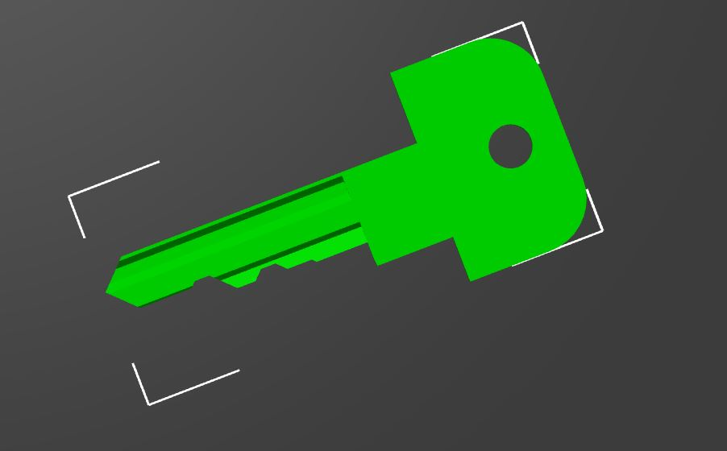

# Kone 1V14001 elevator service key

Elevator service key - used to enable various modes, like VIP/Priority ride, etc.

Bitting - based on photo pixel measurement (attached photos scraped from various online shops).
Measurements from bottom of the key (Instacode style). 
Based on [GAM](../../blanks/GAM) blank.

|   |   |   |   |   |  |
|---|---|---|---|---|--|
| Cut distance | 7.5 mm | 11.5 mm | 15.0 mm | 19.00 mm | 22.5 mm |
| Cut height   | 8.07 mm  | 7.00 mm  | 8.07 mm  | 5.59 mm  | 6.21 mm |

